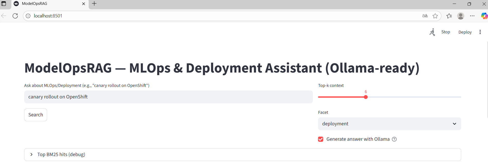
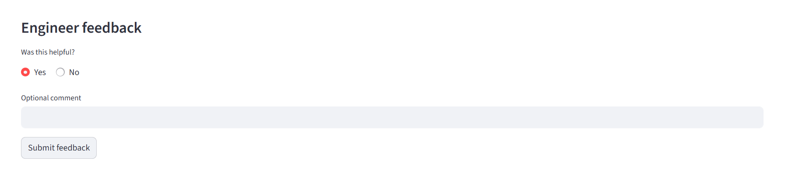
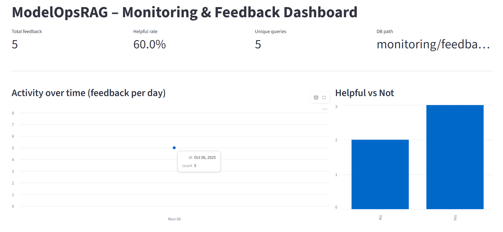
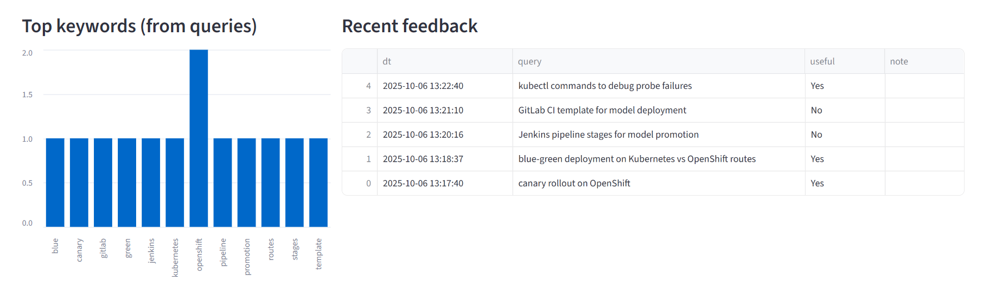

# Project: ModelOpsRAG

---

## Problem & Motivation

Machine learning engineers often spend hours searching across fragmented documentation — internal wikis, MLOps playbooks, CI/CD runbooks, and Kubernetes deployment guides — to find how to roll out, monitor, or govern production models.
ModelOpsRAG centralizes that operational knowledge into a single Retrieval-Augmented assistant that can answer questions like:

- How to perform a canary rollout on OpenShift?
- What metrics should I log to detect concept drift?
- How to automate model promotion in a Jenkins pipeline?

This project aims to support engineers with reliable, cited, and contextual answers, speeding up model deployment and operational excellence in real MLOps environments.

---

## Objetive
End‑to‑end RAG assistant for MLOps & model lifecycle. It indexes MLOps playbooks, deployment runbooks, CI/CD templates, monitoring guides, and returns actionable answers with citations (e.g., “How to roll out a canary on OpenShift?”, “What should I log for concept drift?”). Includes hybrid retrieval (BM25 + vectors), optional re‑ranking, Streamlit UI, monitoring/feedback, evaluation, and Docker Compose.

RAG assistant for
- **Deployment** (Kubernetes/OpenShift, canary/blue‑green, rollbacks)
- **CI/CD** (Jenkins/GitLab, build/test/deploy patterns)
- **Monitoring** (latency, error rate, drift/performance)
- **Governance** (model registry, approvals, audit trails)

It returns concise answers with **citations** to the indexed docs.

---

## Repository Structure  

```
ModelOpsRAG/
├─ app/
│ └─ main.py
├─ ingest/
│ ├─ ingest.py
│ └─ sources.yaml
├─ retriever/
│ ├─ bm25.py
│ ├─ vectors.py
│ ├─ rrf.py
│ ├─ rerank.py
│ └─ rewrite.py
├─ eval/
│ ├─ questions.jsonl
│ ├─ gold_labels.jsonl
│ └─ evaluate.py
├─ monitoring/
│ ├─ feedback_db.py
│ └─ dashboard.py
├─ data/
│ ├─ raw/
│ │ └─ docs/
│ │ ├─ mlops_playbook.md
│ │ └─ kubernetes_ops_cheatsheet.md
│ └─ processed/
├─ docker/
│ ├─ Dockerfile
│ └─ docker-compose.yml
├─ Makefile
├─ requirements.txt
├─ .env.example
└─ README.md
```

---

## Installation  

```bash
git clone https://github.com/sanchis135/ModelOpsRAG.git
cd ModelOpsRAG
python -m venv .venv
& .venv\Scripts\activate
pip install --upgrade pip
pip install -r requirements.txt
```

---

## Ollama Setup
1. Install Ollama
2. Pull models
```bash
ollama pull llama3.1:8b
ollama pull nomic-embed-text
```
3. Add to your .env file:
```bash
OLLAMA_HOST=http://127.0.0.1:11434
OLLAMA_CHAT_MODEL=llama3.1:8b
OLLAMA_EMBED_MODEL=nomic-embed-text
EMB_BACKEND=ollama
```
4. If running Dockerized app while Ollama runs locally (Linux), add:
```bash
extra_hosts:
    - "host.docker.internal:host-gateway"
```

---

## Quickstart
1. Build the knowledge base
```bash
python ingest/ingest.py
```
2. Delete vectorial index
```bash
Remove-Item -Recurse -Force .chroma -ErrorAction SilentlyContinue
```
3. Run the Streamlit app
```bash
streamlit run app/main.py
# open http://localhost:8501
```

In the Streamlit app you have to add your query:
<p align="center">
  
</p>

when you get the answer, you should add your feedback to database clicking in 'Submit feedback':
<p align="center">
  
</p>

---

## What’s inside
- Hybrid retrieval: BM25 + vectors (Chroma) with optional re‑ranking
- Streamlit UI with query, facets, and feedback
- Eval scripts (retrieval metrics + output stub)
- Docker Compose (app + Chroma)

---

## Features
- Hybrid retrieval (BM25 + Chroma vector DB)
- Query rewriting and optional re‑ranking
- Streamlit UI for search and exploration
- Feedback logging + monitoring dashboard in Streamlit
- Evaluation scripts for retrieval and output quality
- Full Docker Compose for reproducibility

---

## Evaluation
Metric	        | Description
recall@k	    | Coverage of relevant docs among top‑k retrieved
nDCG@k	        | Normalized discounted cumulative gain for ranked results
keyword match	| Simple output validation against gold labels

Evaluate BM25, vectors, and hybrid retrieval using:
```bash
python eval/evaluate.py --k 5
```

Results:
{
  "k": 5,
  "bm25": {
    "ndcg@k": 0.9599,
    "precision@k": 0.3,
    "recall@k": 1.0
  },
  "vector": {
    "ndcg@k": 0.9386,
    "precision@k": 0.3,
    "recall@k": 1.0
  },
  "rrf": {
    "ndcg@k": 0.9599,
    "precision@k": 0.3,
    "recall@k": 1.0
  },
  "best": "bm25"
}

---

## Monitoring & Feedback

ModelOpsRAG includes a lightweight monitoring and feedback system to track user queries, retrieval relevance, and LLM response quality over time.
Feedback is persisted locally in an SQLite database (monitoring/feedback.db) and visualized through a Streamlit dashboard.

### Feedback Storage

Each query is stored with:
- timestamp
- question
- retrieved_docs
- answer_summary
- relevance_score (1–5 user feedback)

Example schema:
```sql
CREATE TABLE feedback (
    id INTEGER PRIMARY KEY AUTOINCREMENT,
    timestamp TEXT,
    query TEXT,
    answer TEXT,
    relevance INTEGER
);
```

### Streamlit Monitoring Dashboard
You can launch a separate Streamlit dashboard to visualize usage and feedback trends:
```bash
streamlit run monitoring/dashboard.py
# open http://localhost:8502
```

Dashboard panels include:

Chart	                | Description
Recent Queries	        | Table of last 10 user interactions
Average Relevance	    | Gauge chart showing mean feedback score
Retrieval Mode Usage	| Bar chart: BM25 vs Vector vs Hybrid
Queries Over Time	    | Time-series of interactions per day
Top Topics	            | Word cloud or bar chart of frequent keywords

Example with 5 queries in the database:

<p align="center">
  
</p>

<p align="center">
  
</p>


### Feedback Loop
This setup enables a human-in-the-loop retriever evaluation, where user feedback can be exported for later retraining or model refinement:
```bash
# Export to CSV
python monitoring/export_feedback.py --format csv

# Export to JSONL
python monitoring/export_feedback.py --format jsonl

# Save in a custom folder
python monitoring/export_feedback.py -f csv -o reports/
```
In a production MLOps setup, this loop could be extended to automate prompt tuning, hybrid weighting, or retriever re-training based on user behavior.

---

## Containerization & Reproducibility
The project is fully containerized for reproducibility and ease of setup.
Both the Streamlit app and the Chroma vector database run as Docker services, and the environment variables are managed via .env and docker-compose.yml.

### Docker Structure
docker/
├─ Dockerfile          # Builds the Streamlit + Python app
├─ docker-compose.yml  # Orchestrates app + Chroma + Ollama host access

### Build & Run
1. Build the app image
```bash
docker compose build
```
2. Launch all services
```bash
docker compose up
```
→ Streamlit UI: http://localhost:8501
→ Chroma DB: http://localhost:8000

### Environment
Example (.env)
```bash
OLLAMA_HOST=http://host.docker.internal:11434
OLLAMA_CHAT_MODEL=llama3.1:8b
OLLAMA_EMBED_MODEL=nomic-embed-text
CHROMA_DIR=/data/chroma
```
### Base Image
The app image is built on top of python:3.11-slim, and includes:
- streamlit, chromadb, sentence-transformers
- ollama Python client for local model inference
- all dependencies from requirements.txt copied and pinned

### Reproducibility
Running docker compose up rebuilds the full pipeline:
- The ingestion script runs automatically at startup if data/processed is empty.
- The hybrid retriever (BM25 + Chroma vectors) initializes embeddings.
- The Streamlit UI loads dynamically, ready for querying.
Thus, any reviewer can reproduce the entire setup with a single command.

---

## Cloud / OpenShift Deployment (Bonus)

The container can be easily deployed to any Kubernetes or OpenShift environment.

### Deploy on OpenShift
1. Log in to your OpenShift cluster
```bash
oc login --token=<your-token> --server=<your-api-url>
```
2. Create a new project
```bash
oc new-project modelopsrag
```
3. Deploy the app directly from Docker Hub or local image
```bash
oc new-app python:3.11~https://github.com/sanchis135/ModelOpsRAG.git \
  --name=modelopsrag \
  --context-dir=/app \
  --env=OLLAMA_HOST=http://ollama-service:11434 \
  --env=OLLAMA_CHAT_MODEL=llama3.1:8b \
  --env=OLLAMA_EMBED_MODEL=nomic-embed-text
```
4. Expose the route
```bash
oc expose service/modelopsrag
```
Result:
- Public endpoint available at https://modelopsrag.apps.<cluster-domain>
- Chroma DB runs as a persistent volume claim (/data/chroma)
- Ollama can be configured as an internal microservice or external node (ollama-service)

---

## Improvements

Future improvements could include:

- Few-shot examples for improved style control.
- LLM-as-a-judge evaluation to automate factuality scoring.
- Evaluation on different Ollama models (llama3.1:8b, phi3:mini, etc.).

---

## Ethics & Security
Do not ingest sensitive or internal documents without permission.
Mask API keys or secrets before indexing.
Ensure licensing compatibility when adding external docs.

---

## Professional Alignment

This project explores practical RAG applications for ModelOps documentation, reflecting real MLOps processes used in enterprise environments. It serves both as a learning artifact and as a prototype for AI‑assisted operational knowledge search.
